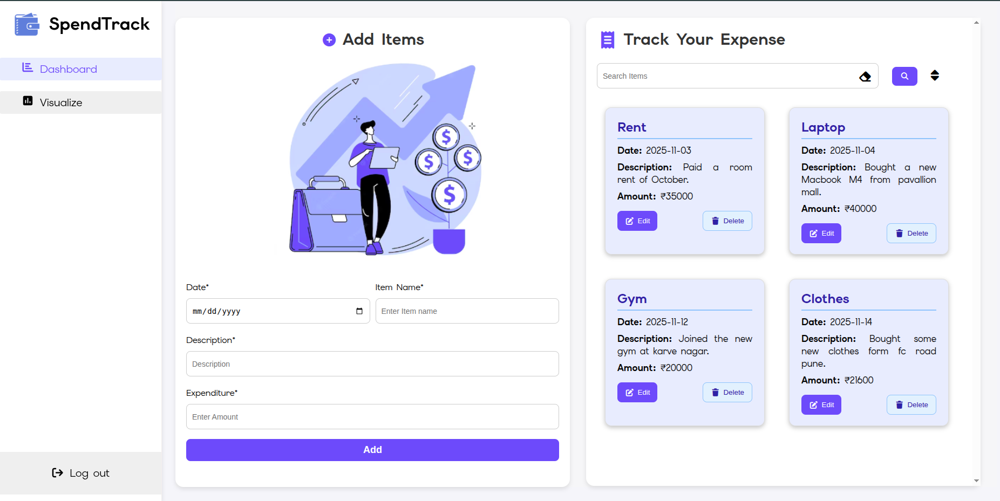
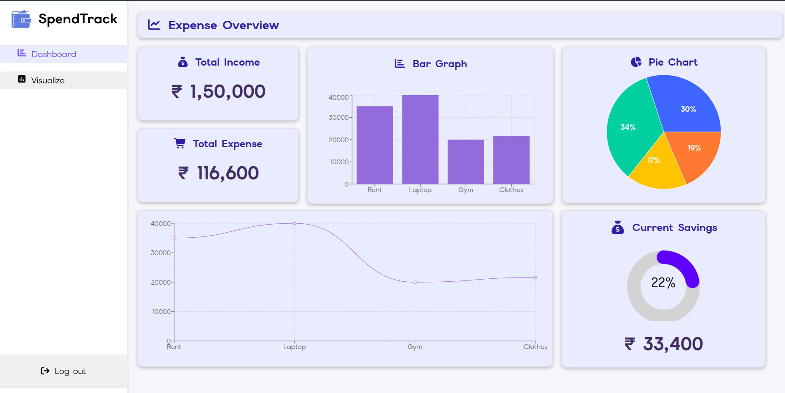

# 💰 SpendTrack  | Expense Tracker  [(Link)](https://expense-tracker-zeta-nine-13.vercel.app/)

ShopeEase is an E-commerce web application built using **React**, **Recharts** . It provides a clean UI, visualize the Income and Expense, Expense management and a modular structure suitable for scaling into a full-featured Expense Tracker Web application.



## 📖 Table of Contents
- [Introduction](#-introduction)
- [Features](#-features)
- [Tech Stack](#-tech-stack)
- [Installation](#️-installation)
- [Screenshots](#screenshots)
- [License](#-license)

## 📝 Introduction
ShopeEase is designed to Track the income and expense where users can track their expenses and also visualize it using bar graphs, line graphs etc.

## ✨ Features
- Add/remove the expense
- Search/Filter/sort the expense
- Bar,Line graphs to track the expense
- Track remaining savings
- Update the expense
- Data stored into the Localstorage


## 🧰 Tech Stack
- React.js
- Vanilla CSS
- Recharts (for graphs)

## ⚙️ Installation

```
git clone git@github.com:patilOm1680/Expense-Tracker.git

```
```
cd Expense-Tracker
```
```
npm run dev
```

## Screenshots




## 📄 License
No license ;
